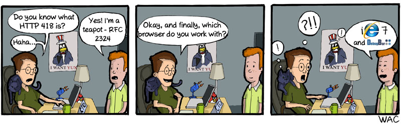

# WallPaperMaster
WallPaperMaster is a simple application which gets the latest commit strip from www.commitstrip.com and sets it as your wallpaper

## Modes  
WallPaperMaster has 2 Modes.  

### Mode 1  
Mode 1 is the default mode that is used if nothing is specified. Mode 1 always sets the newest commitstrib available as your wallpaper.  

### Mode 2  
Mode 2 will the first time WallPaperMaster is run set the first ever commitstrib as your background.  

**First Commitstrib, Interview**  
  

After that it will change your WallPaper everyday to the next commitstrib, so you have a new commitstrib everyday until you have seen them all!  
When all stribs has been seen, WallPaperMaster will show you the newest strib available.  

**Customization**  
To customize behaviour when in mode 2, edit the file *%appdata%\wallpapermaster\commitstribData.txt*.  
The file contains 3 lines.  

|Line Number|Description|
|-|-|
|1|URL to first commit-strib that should be showed. This is normally the first ever commitstrib|
|2|URL to the next commit-strib that should be shows. This can be changed if you want to "jump" in the timeline|
|3|Date of when wallpaper was last changed. Used to check if wallpaper should be changed as WallPaperMaster only changes your wallpaper once a day|